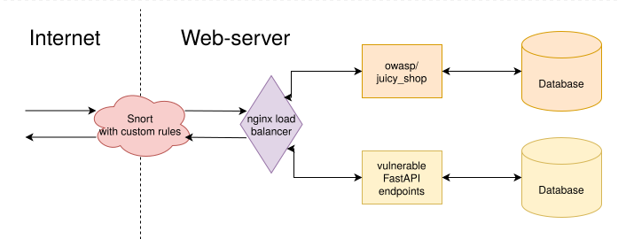

# Snort IDS/IPS System | SA Team

    
 
        <pre>
.      (\_/)
.      (•_• )
.   ＿ノ ヽ /＼ __
.  / /  ⌒Y⌒ ヽ|  \
. | __⌒＼ ￣￣ヽ   |
. ヽ＿＿＿＞､＿＿_／
.     ｜( 王 )〈
.     / ﾐー――彡 \
        </pre>
    

    

        <b>Team:</b> 
        1. Eldar Mametov 
        2. Aleksandr Ryabov 
        3. Mikhail Voronin 
        4. Artem Bulgakov 
        5. Ruslan Belkov 
          
        <b>Github Repository:</b> 
        <a href="https://github.com/Lekski1/SSD_petproject">https://github.com/Lekski1/SSD_petproject</a>
    

---

## Table of Contents

- [Snort IDS/IPS System | SA Team](#snort-idsips-system--sa-team)
  - [Table of Contents](#table-of-contents)
  - [Introduction](#introduction)
  - [Methods](#methods)
  - [Results](#results)
  - [Discussion](#discussion)
  - [Meme](#meme)

---

## Introduction

**Project Objective:**
This project implements the task of deploying and configuring a Snort or Suricata intrusion detection/intrusion prevention system (IDS/IPS) in front of a web application. The project includes the following key steps based on the requirements of the training course:

* Deploying the Snort IDS/IPS system.
* Applying an adequate security configuration, with customization of at least 3 settings.
* Simulating an attack on a web application.
* Detecting and/or preventing the simulated attack using IDS/IPS.

**Selection of Tool (Snort V2):**    
Snort version 2 was selected as the IDS/IPS. It was chosen for the following reasons:        
* Having some of the team have previous experience with Snort V2, which speeds up the deployment and initial configuration process.
* Relative ease of installation and configuration compared to the newer version.
* Redundancy of Snort V3 functionality. Snort version 2 has all the functionality needed to complete the project. 

## Methods

  
*The system architecture*

To implement the project, we used a vps server on which we deployed all the necessary components for testing our project 

1.  **Development of target web application on FastAPI:**
    * A simple web application on FastAPI framework was developed.
    * Each participant implemented a specific Endpoint intentionally containing a specific vulnerability.
    * Implemented vulnerabilities by the respective team members: 
        * XSS (Cross-Site Scripting) - Artem Bulgakov
        * Server-Side Request Forgery (SSRF) - Alexander Ryabov
        * Path Traversal - Ruslan Belkov
        * XXE (XML External Entity) - Mikhail Voronin
        * SQL Injection - Eldar Mametov

2.  **Individualized development of vulnerabilities and Snort rules:**
    * For each vulnerability introduced (one Endpoint per team member), the responsible participant developed specialized rules for Snort V2.
    * The purpose of the written rules is to detect popular attack methods on their Endpoint and prevent that attack. 

3.  **Infrastructure Setup:**
    * Deploying Snort V2 on an ubuntu 24 based vps.
    * Using containerization (Docker) to deploy a web application on FastAPI and writing Nginx configurations to run two sites correctly on the same vps server. Mikhail Voronin was responsible for container and Nginx configuration.
    * Basic Snort configuration, including network setup and rules connection, was performed by Eldar Mametov.

4.  **Additional testing on Juice Shop:**
    * To test standard snort rules from the community, juice-shop, which includes many vulnerabilities, was additionally deployed and a separate snort.conf was run under it to test its operation. 

## Results

Video demonstration: https://www.youtube.com/watch?v=ReR8faoU8bI

Proprietary rules output: When creating rules, it is preferable to initially consider a service as a “black box” to cover more vulnerable cases, and then consider it as a “white box” to cover service-specific cases. In our case, knowing the set of attacks and corresponding vulnerabilities in advance, we were able to quickly write rules targeting the basic attack vectors. We note that the developed signatures cover only the simplest manually tested attacks and require further refinement and extension. The video shows that the vulnerabilities are no longer available. 

Conclusion on standard rules: Testing the standard rules on juice-shop has shown that you cannot focus only on the standard rules for detecting potential threats. You should write your own rules for snort, even if you need basic protection, because the standard rules do not provide it to the necessary extent. 

## Discussion

During the course of the project, the objectives were successfully achieved: the Snort system was deployed and configured, and the developed rules effectively detect and prevent attacks on the target web application. All five simulated vulnerabilities (XSS, SSRF, Path Traversal, XXE and SQL injection) are reliably blocked by the specially created signatures. Additional testing on the OWASP Juice Shop showed that the standard available snort rules work inefficiently and cannot protect the infrastructure from standard attacks, even at the IDS level.

**Key findings and results:**

1.  **Effectiveness of custom rules:** The rules developed by the team for Snort V2 demonstrated their validity in repelling basic attack vectors. This process allowed participants to deepen their understanding of specific vulnerability exploitation mechanisms and learn practical skills for writing effective signatures for IDS/IPS.
2.  **Practical Team Experience:** Each team member successfully completed the individual task of creating a vulnerable endpoint and developing the corresponding Snort rule, which contributed to the collective growth of network security competencies.
3.  **Selection of Snort V2:** For this training project, the functionality of Snort V2 was sufficient and the team did not encounter any significant limitations. However, it should be noted that Snort V3 would have been more relevant for more complex, high-volume production environments. The advantages of the third version, such as the ability to hot reload rules without stopping the service, improved scalability, and enhanced capabilities for deep traffic analysis (including the connection of application layer analysis modules), make it more preferable in real-world scenarios.

**Prospects for further development:**

If this project were to evolve towards protecting a commercial product with an active user base, the focus would shift to the following aspects:

* **Rule Base Expansion:** Not only creating rules to block unambiguously malicious packets, but also developing signatures to generate warnings about suspicious activity that requires additional analysis.
* **Monitoring and analytics:** Implement continuous monitoring of security events, collecting and analyzing logs to identify anomalies and attack patterns.
* **Proactive Rule Updates:** Regularly update existing rules and write new rules based on analysis of current threats, security bulletins and data from Threat Intelligence feeds.
* **Integration with SIEM/SOAR:** Connecting Snort to Security Information and Event Management (SIEM) systems to correlate data with other sources and possibly to SOAR platforms to automate some response processes.
* **Testing and Optimization:** Ongoing testing of rule effectiveness (including false positive tests) and optimizing Snort performance to minimize impact on network traffic.

Overall, the project provided valuable hands-on experience in deploying, configuring, and operating an IDS/IPS system, as well as developing signatures to detect and prevent web-based attacks.

## Meme
